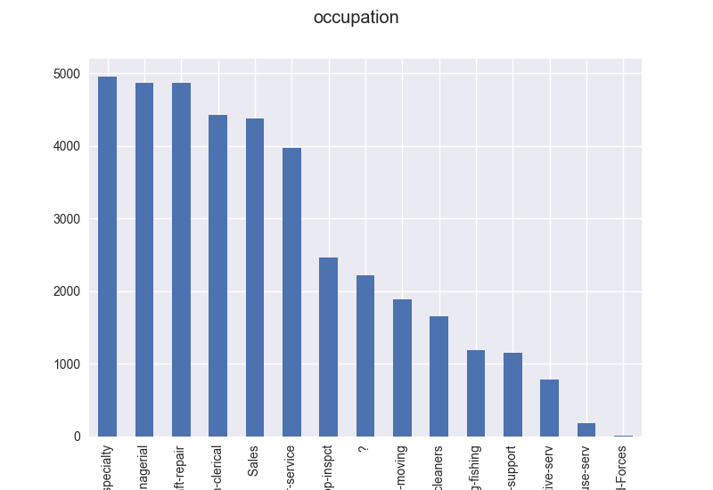
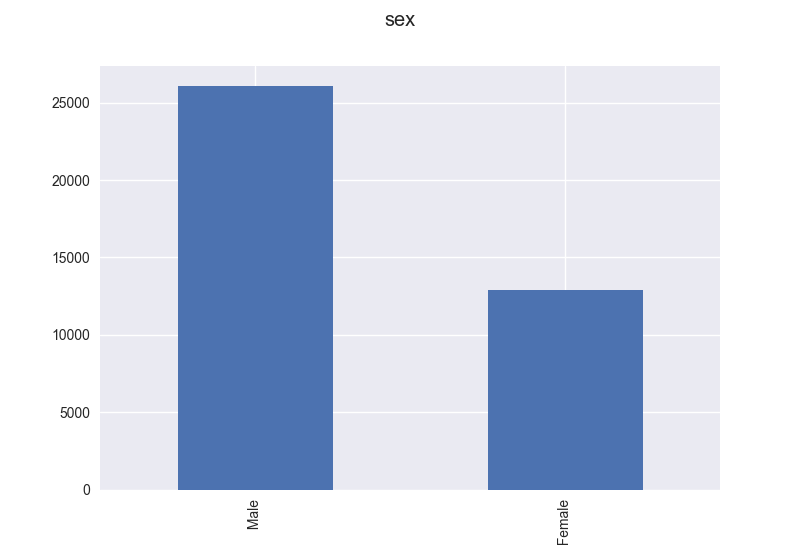

## Census Income Prediction

The task is to predict whether income exceeds $50K/yr based on census data. Also known as *Census Income* data set.

### Data set description

The *Census Income* data set is used for this assignment. It has many continuous value and categorical value features, this would help in learning to handle various types of features while building complex machine learning models. Such a mixture would also gives a good opportunity to learn data visualization.

Though the data set is publicly available a scrambled verison of the data set is being used.

Below is a brief overview of type and values for various features in the data set:

1. `age`: continuous. 
2. `workclass`: Private, Self-emp-not-inc, Self-emp-inc, Federal-gov, Local-gov, State-gov, Without-pay, Never-worked. 
3. `fnlwgt`: continuous. 
4. `education`: Bachelors, Some-college, 11th, HS-grad, Prof-school, Assoc-acdm, Assoc-voc, 9th, 7th-8th, 12th, Masters, 1st-4th, 10th, Doctorate, 5th-6th, Preschool. 
5. `education-num`: continuous. 
6. `marital-status`: Married-civ-spouse, Divorced, Never-married, Separated, Widowed, Married-spouse-absent, Married-AF-spouse. 
7. `occupation`: Tech-support, Craft-repair, Other-service, Sales, Exec-managerial, Prof-specialty, Handlers-cleaners, Machine-op-inspct, Adm-clerical, Farming-fishing, Transport-moving, Priv-house-serv, Protective-serv, Armed-Forces. 
8. `relationship`: Wife, Own-child, Husband, Not-in-family, Other-relative, Unmarried. 
9. `race`: White, Asian-Pac-Islander, Amer-Indian-Eskimo, Other, Black. 
10. `sex`: Female, Male. 
11. `capital-gain`: continuous. 
12. `capital-loss`: continuous. 
13. `hours-per-week`: continuous. 
14. `native-country`: United-States, Cambodia, England, Puerto-Rico, Canada, Germany, Outlying-US(Guam-USVI-etc), India, Japan, Greece, South, China, Cuba, Iran, Honduras, Philippines, Italy, Poland, Jamaica, Vietnam, Mexico, Portugal, Ireland, France, Dominican-Republic, Laos, Ecuador, Taiwan, Haiti, Columbia, Hungary, Guatemala, Nicaragua, Scotland, Thailand, Yugoslavia, El-Salvador, Trinadad&Tobago, Peru, Hong, Holand-Netherlands.

Note that in the train and test data, `salary` >$50K is represented by 1 and <=$50K is represented by 0.

### Whats done here?

- A neural network is developed from scratch  without using any library implementations. For this purpose, a multi layer neural network with backpropagation is written.
- Appropriate feature engineering is used to improve model's accuracy. 
- 3 other standard classification techniques to solve the same problem using standard off the shelf python libraries.
- Compared the above 3 standard techniques for classification with that of the NN implementation.

### Data Visualization and Feature Engineering

#### Missing Values

The data has some missing values in many coloumns. While such entries are in about a fraction of data and could be ignored, but then the trained model would not be able to handle any missing values. So, missing values are treated as another category in the same coloumn.

#### Coloumns

To get an idea of each attribute of data, plot distribution of each coloumn. For continuous valued coloumn distribution can be plotted directly, but for discontinuous valued coloumns, a histogram is plotted instead.

Following plots depict the distribution of coloumns

            | 
---------------------------------------|---------------------------------------
   | 
  | 
 | 
 | 
           | 
         | 
      | 

From the native country coloumn, it can be seen that 90% of the data is from US.

#### Correlation

Correlation between different coloumns is calculated and plotted in form of a heat map.

It can observed that correlation between `education` and `education-num` is high. This is because `education-num` is numeric representation of `education` coloumn. Both the coloumns convey the same information. Hence, `education` can dropped. This is because keeping `education-num` helps avoid some preprocessing as it is already in numeric form.

#### Min max scaling

Rest of the categorical data is converted to numeric values and min max scaling is applied to it so as to avoid formation of ill conditioned feature matrix.

#### One hot encoding

For discontinuous values, it is more appropriate to express them as vectors with only one value being true, corresponding to respective category. This increases the number of features. So, one hot encoding is applied.

### Code Walkthrough

#### Data Visualization and Preprocessing

- Both `train.csv` and `kaggle_test_data.csv` are read by using `pandas` and `id`s coloumn from test data is saved. Then ids coloumn from both the data frames are dropped.
- Then data disualization section is  for plotting distribution of each coloumn of data (now commented out as this is required only the first time).
- A list of coloumn headers is populated and continuous valued headers are dropped from this list. For each coloumn mentioned in this list, the string values are replaced by appropriate numeric values.
- Then correlation matrix is plotted in form of heatmap using `seaborn` library (now commented out as this is required only the first time).
- The `salary` coloumn from train data is dropped. `education` coloumn is dropped from both train and test data. This is followed by one hot encoding of each discontinuous valued coloumn. This is done by adding extra coloumns of 0s or 1s at end of data frame based on value for each example and the original coloumn is dropped.
- Then min max scaling is applied by subtracting minimum value of each coloumn of train data from all the elements of that coloumn in train and test data. This is then followed by division by maximum value of each coloumn of train data in similar manner.
- This part of code is used in all the scripts.

#### Neural Network
	
- Sigmoid activation is used throughout the neural network, so, sigmoid and its derivative is defined at the beginning. Then appropriate random weights are initialized for 2 layered neural network with 100 and 25 neurons each. There is an extra coloumn for bias in weight matrices. Step size, iterations and lambda values are defined in next part.
- A coloumn of 1s is added to train and test data to account for extra bias coloumns in weight matrices.
- Training takes place in a for loop that runs over total number of iterations as defined previously. In each step, forward propagation takes place via matrix multiplication. Then cross entropy cost is calculated. This is then followed by calculation and backpropagation of gradients. For, this first delta for last layer is calculated, it is then multiplied by previous layer output to get gradient. To calculate delta for previous, current delta is multiplied by current weight matrix. All the calculations are implemented in form of matrix multiplication because numpy is more efficient in handling such calculations and for loop cause extra delays.
- Then regularization term is added only to terms corresponding to weights in the weight matrices. Weight matrices are then updated according to gradient and step size.

#### Step Size Update

Step size gets updated based on previous error or cross entropy cost value. If past error is more, it means error is decreasing and it is safe to increase step size a little bit. Otherwise, it means that error is either same or increasing, in this case step size should be decreased.

Once training is done, training accuracy is calculated by forward propagating train data once again with the fully updated weight matrices and comparing them with salary coloumn.

### Observations

Network | Initial Step Size | Iterations | Lambda | Train Accuracy | Test Accuracy
--------|-------------------|------------|--------|----------------|--------------
10, 50 | 0.1 |1000 | 0.1 | 0.85392| 0.77619
75, 25 | 0.12 | 5000 | 0.1 | 0.84966 | 0.75905
2, 20 | 0.12 | 20000 | 0.1 | 0.8535 | 0.77343
2, 20 | 0.15 | 20000 | 0.1 | 0.85320 | 0.78023
2, 20 | 0.2 | 20000 | 0.1 | 0.8533 | 0.78042
2, 20 | 0.5 | 20000 | 0.01 | 0.8549 | 0.78062
2, 20 | 0.1 | 50000| 0.1 | 0.856439 | 0.78042
100, 300 | 1| 10000| 0.1| 0.852 | 0.76985
100, 300 | 1 | 1000 | 0.1 | 0.8413 | 0.73575
100, 25 | 0.1 | 1000 | 0.1 | 0.83 | 0.72181
100, 25 | 0.12 | 5000 | 0.1 | 0.849 | 0.7610
100, 25 | 0.12 | 10000 | 0.1 | 0.8520 | 0.77108
100, 25 | 0.12 | 15000 | 0.1 | 0.85266 | 0.7742
100, 25 | 0.1 | 500000 | 0.1 | 0.85887 | 0.78269

It was observed that changing step size does not affect accuracies much, because step size correction is implemented in code. Neural network with 2, 20 neurons in respective layers takes much less time to train than 100, 25 one. But, only 2 neurons in first layer might cause loss of information hence is not suitable even id accuracies achieved are quite similar to that of a 100, 25 neuroned network.

### Comparison

Three standard techniques chosen were Logistic Regression, Decision tree, Support Vector Classifier and K nearest neighbours. These were implemented using `scikit` learn library.

Following table shows the train accuracies obtained from standard implementation in comparison with neural network implementation done for this assignment:

Model | Accuracy
------|---------
Logistic regression | 0.851744
Decision tree | 0.999897
Support vector classifier | 0.828497
K - Nearest Neighbours | 0.866805
Neural Network implementation (20000 iterations) | 0.853520

From the above table, it can be seen that, the implemented neural network, after being trained for 20000 iterations, performs comparably well over Support Vector Classifier and Logistic Regression. K-Nearest Neighbours performs close to the implemented neural network while Decision tree reaches 99% train accuracy.
